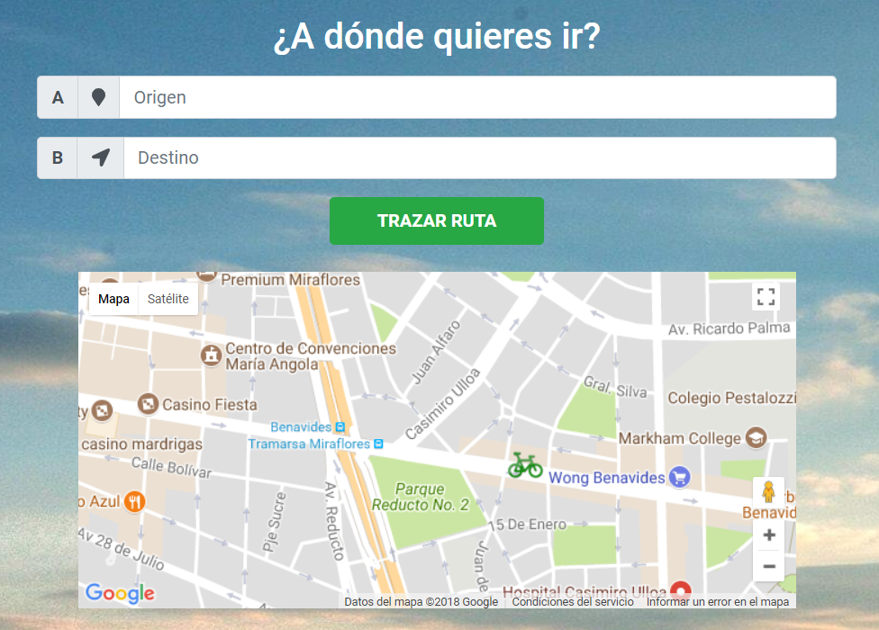
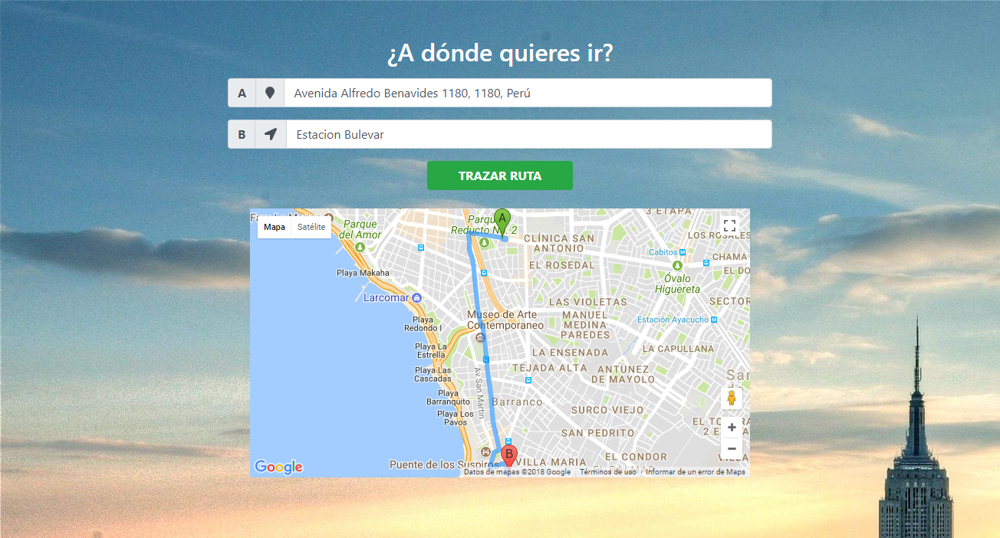

# EASY VRECO
> Desarrollado por: Lucero Hospina y Milagros Palma

## Ejercicio Práctico

* **OBJETIVO**: Desarrollar en parejas el ejercicio práctico de **GEOLOCATION**.

* Desarrollar una página web responsive donde podamos dar instructivos de rutas.

* Emplear el api de geolocalización de **HTML5** y el api de **Google Maps**

* Sobre la **funcionalidad**:

   1. Insertar un mapa de Google Maps indicando nuestra ubicación actual.

   2. Por medio de dos INPUT poder trazar una ruta en el mapa desde un punto de inicio y uno de llegada.

   3. Habilitar el autocompletado de Google Places.

   4. Personalizar el marcador por defecto del mapa.

 ## Implementación

 

 

 ## Herramientas
 `HTML5` `CSS3` `JavaScript` `Geolocation API` `Google Maps` `Bootstrap 4`

